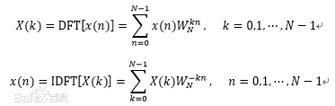
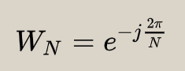
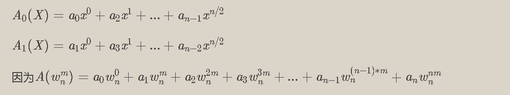
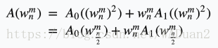
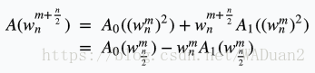
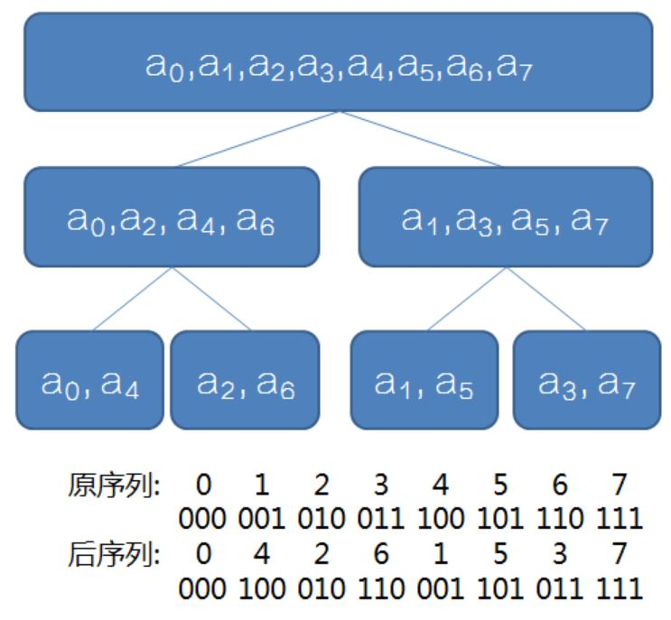

# FFT学习笔记

参考如下:

> 视频参考：
> 
> 文档参考 : [CSDNFFT算法讲解——麻麻我终于会FFT了！](https://blog.csdn.net/WADuan2/article/details/79529900?spm=1001.2101.3001.6650.2&utm_medium=distribute.pc_relevant.none-task-blog-2%7Edefault%7ECTRLIST%7Edefault-2-79529900-blog-81478582.pc_relevant_blogantidownloadv1&depth_1-utm_source=distribute.pc_relevant.none-task-blog-2%7Edefault%7ECTRLIST%7Edefault-2-79529900-blog-81478582.pc_relevant_blogantidownloadv1)
> 
> [十分简明易懂的FFT（快速傅里叶变换）](https://blog.csdn.net/enjoy_pascal/article/details/81478582?ops_request_misc=%257B%2522request%255Fid%2522%253A%2522165465630616782246413767%2522%252C%2522scm%2522%253A%252220140713.130102334..%2522%257D&request_id=165465630616782246413767&biz_id=0&utm_medium=distribute.pc_search_result.none-task-blog-2~all~baidu_landing_v2~default-5-81478582-null-null.142^v11^pc_search_result_control_group,157^v13^control&utm_term=fft%E5%8F%98%E6%8D%A2&spm=1018.2226.3001.4187)
> 
>  [FFT算法小结](https://blog.csdn.net/adfa4535/article/details/101184891)
> 
> <br/>

<br/>

## 学习进度

- [ ] FFT了解
- [ ] FFT的具体过程

<br/>

一、FFT了解

***

- 概念：FFT是一种DFT的高效算法，是离散傅氏变换（DFT）的快速算法。它是根据离散傅氏变换的奇、偶、虚、实等特性，对DFT进行改进获得的。称为快速傅立叶变换（fast Fourier transform）。
  
  <br/>
- 分类：可分为按时间抽取算法和按频率抽取算法。
  
  而一般的时间抽取法和频率抽取法只能处理长度N=2M的情况，另外还有组合数基四FFT来处理一般长度的FFT。
  > 概念：所谓抽选，就是把长序列分为短序列的过程，可在时域也可在频域进行。
  > 
  > 最常用的时域抽选方法是将时域信号序列按奇偶将长序列不断地变为短序列，结果使输入序列为倒序，输出序列为顺序排列，这就是Coolly—Tukey算法 。                
  > 
  > 时域信号序列将频域信号序列按偶奇分排。
  
  <br/>
- DFT离散傅氏变换的快速运算: 
  
    
  
  式中:          

> 由这种方法计算 DFT 对于一个k值的X(k)，需要进行4N次实数相乘和（4N-2）次相加；对于N个k值，共需 N*N次相乘 和 N(4N-2)次实数相加。
> 
> 改进DFT算法，减小它的运算量，利用DFT中 的周期性和对称性，使整个DFT的计算变成一系列迭代运算，可大幅度提高运算过程和运算量，这就是FFT的基本思想。

<br/>

- FFT用途：
  
  # **加速多项式乘法:**
  
  如果我们当前有两个多项式f(x) , g(x) 现在要把他们乘起来(求卷积)，最朴素的做法就是
  
  $$\sum_{i=0}^{2n-1}\left ( \sum_{j=0}^{i}a_{j}\ast b_{i-j} \right )\ast x^{i}$$
  
  <br/>
  
  <br/>
  
  这样的复杂度是O($n^{2}$) , 十分不美观，FFT就是要将这个过程优化为O($nlogn$) !
  
  <br/>
  
  # **前置技能：**
  
  <br/>
  
  <br/>
  
  ### 单位根：
  
  ***
  
  数学上，n次单位根是n次幂为1的复数。它们位于复平面的单位圆上，构成正n边形的顶点，其中一个顶点是1。
  
  复数w 满足$w^{n}$= 1 ，称作是n 次单位根，下图包含了所有的8 次单位根（8个点已做标记）
  
  <br/>
  
  <br/>
  
  将其用弧度制表示便有$$w_{n}^{k}=cos k\ast \frac{2\pi }{n}+i\ast sink\ast \frac{2\pi }{n}$$
  
  我们把这样的单位根代入到多项式A(x)中得到对应的值，这个过程叫做DFT（离散傅里叶变换）。
  
  $$w_{2n}^{2m}=w_{n}^{m}$$
  
  性质：$$w_{n}^{m}=-w_{n}^{m+\frac{n}{2}}$$
  
  ***
  
  ### 多项式的系数表达法：
  
  我们有多项式:f(x)
  
  <br/>
  
  则称A(X)为多项式f(X)的系数表示法.
  
  在系数表示法下，计算多项式乘法是O($n^{2}$) .
  
  ### 多项式的点值表达法:
  
  在函数图像中，F[x]这个多项式可以被n个点唯一确定，即代入n个点作为x,分别解出对应的 y，得到n个式子。把这n条式子联立起来成为一个有n条方程的n元方程组，每一项的系数都可以解出来.（可类比二元一次方程） 也就是说，使用
  
   就可以完整描述出这个多项式,这就是多项式的点值表示法.
  
  点值表示法算多项式乘法是O($n$) 的 .
  
  <br/>

<br/>

<br/>

<br/>

<br/>

### 二、FFT的具体过程

***

- FFT的具体过程:
  
  FFT就是将系数表示法转化成点值表示法相乘，再由点值表示法转化为系数表示法的过程，第一个过程叫做求值(DFT)，第二个过程叫做插值(IDFT).

##      求值

设$A_{0}\left ( X \right )$为$A\left ( X \right )$偶次项的和，设$A_{1}\left ( X \right )$为$A\left ( X \right )$奇次项的和，将单位根代入，即



> 保证k<n/2,  代入$w_{n}^{m}$

所以有



> 同理代入$w_{n}^{m+\frac{n}{2}}$



<u>  系数表示法转化成点值表示法相乘：</u>也就是说，只要有了$ A_0(X)$和$ A_1(X)$)的点值表示，就能在O($n$) 时间算出$ A(X)$的点值表示，

<br/>

对于当前层确定的位置i ，就可以用下一层的两个值更新当前的值，我们称这个操作为“蝴蝶变换”.

因为这个过程一定要求每层都可以分成两大小相等的部分，所以多项式最高次项一定是 $2^{p}$ (p∈N)次方，如果不是的话，直接在最高次项-补零就可以啦!

***

两个多项式后面一坨东西只有符号不同,就是说，如果已知$A_{0}\left ( w _{\frac{n}{2}}^{m}\right )$和$w_{n}^{m}A_{0}\left ( w _{\frac{n}{2}}^{m}\right )$式的值，我们就可以同时知道$A_{}\left ( w _{{n}}^{m}\right )$和$A_{}\left ( w _{{n}}^{m+\frac{n}{2}}\right )$的值，现在我们就可以递归分治来搞FFT了 。

每一次回溯时只扫当前前面一半的序列，即可得出后面一半序列的答案。时间复杂度就为

O($nlog_{2}n$) 。



<br/>

我们发现了原序列与后序列之间每个位置上的数的对应关系就是原序列的数的二进制翻转。

<br/>

我们可以考虑从下面（最底层开始）一层一层的向上合并，最后得到我们想要的结果

<br/>

##      插值

***概念***：插值只要将所有$w_{n}^{m}$换成$w_{n}^{m+\frac{n}{2}}$，也就是所有的虚部取相反数，再将最终结果除以len 

```c_cpp
const double DFT=2.0,IDFT=-2.0;///进行求值，第二个参数传DFT，插值传IDFT
inline void FFT(Complex a[],double mode){
    for(int i=0;i<len;i++)
        if(i<pos[i])
            swap(a[i],a[pos[i]]);
    for(int i=2,mid=1;i<=len;i<<=1,mid<<=1){
        Complex wm(cos(2.0*pi/i),sin(mode*pi/i));
        for(int j=0;j<len;j+=i){
            Complex w(1,0);
            for(int k=j;k<j+mid;k++,w=w*wm){
                Complex l=a[k],r=w*a[k+mid];
                a[k]=l+r;a[k+mid]=l-r;
            }
        }
    }
    if(mode==IDFT)
        for(int i=0;i<len;i++)
            a[i].x/=len;
    return;
}


```

***
