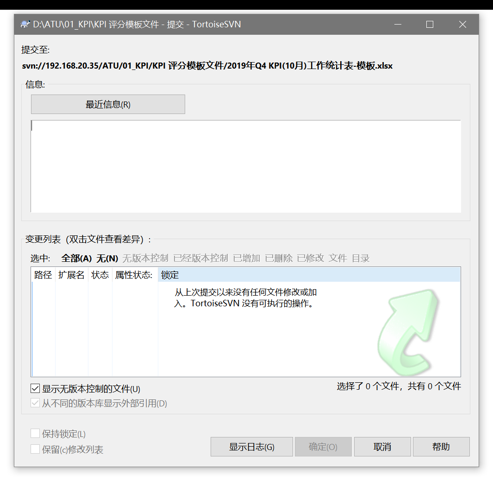

#TortoiseSVN学习笔记

 

***参考如下:***

视频参考：

文档参考 : [TortoiseSVN的安装与使用](https://blog.csdn.net/qq_28566071/article/details/80857928)

				[svn分支管理的使用与经验](https://blog.csdn.net/mycwq/article/details/51793847)

## 学习进度

- [ ] TortoiseSVN的安装与使用

 

四、TortoiseSVN的安装与使用

***

# 1、安装

 

## 1.1、[下载TortoiseSVN](https://tortoisesvn.net/downloads.zh.html)

## 1.2、[下载汉化包](https://tortoisesvn.net/downloads.zh.html)

选择适合自己版本的安装包（相同版本，不然会失败）找到Chinese, simplified汉化包，点击32位或者64位的Setup，下载汉化包。

## 1.3、安装TortoiseSVN

在选择安装路径页面时要记得勾选“command line client tools”，默认不是勾选的。

我试过安装完成后没有出现SVN菜单的，重新打开TortoiseSVN安装包，然后选择“修复”，修复后就出现菜单了。

## 1.4、安装汉化包

点击安装步骤2中下载的汉化包，一步步安装，到最后一步时勾选“Configure TortoiseSVN to use this language”，汉化就完成了。

***

# 2、创建本地版本库

（注意：TortoiseSVN只能创建本地版本库）

## 2.1、建立版本库及目录

新建一个空白文件夹，鼠标右键->TortoiseSVN->在此创建版本库，创建完成后，弹出框里选择“创建目录结构”。

创建完成后，打开版本库浏览器，可以看到目录结构如下图。

> branches为分支，作为日常开发目录，是比较不稳定的版本。有开发任务时，从trunk打分支到branches,分支命名以dev_为前缀，加上日期（如果trunk分支在测试且证明极度不稳定，想获取稳定分支，就tags取），比如dev_1.0.1_20180620。开发完成并自己测试完成后，由负责人合并到主干；
> 
>  
> 
> trunk为主干，负责人负责将分支上的代码合并到主干上，是比较稳定的版本。测试时是使用主干上的代码，但是测试未完成时负责人要避免将分支上的代码合并到主干上，会导致测试返工；

> 
> tags为标签，是最稳定的版本。测试部门测试完成后，将trunk上的代码打分支到标签发布。发布后做好记录，方便回滚和记录。命名发v为前缀，加上日期命名，比如：v1.0.0_20180625。

# 3、检出与提交

## 3.1从版本库中检出代码

新建空文件夹，空白处鼠标右键->SVN检出，弹出检出页面，填写版本库URL或者点击旁边的按钮进入版本库浏览器选择要检出的目录。

检出完成后可以在本地看到检出的文件及目录，并且每个文件和目录的图标上都有一个绿色的勾，如下图：

当对文件进行编辑时，图标上绿色的勾就会变成红色的感叹号：

对文件编辑完成后，鼠标右键->SVN提交，在弹出的提交窗口填写本次编辑的内容，点确定提交本次修改到版本库中

 

### 3.3解决冲突

当有两个人同时编辑一个文件，第一个人提交时是正常的，第二个人提交时会提示更新工作副本，点确定更新时会出现版本冲突。当一个文件出现冲突时，文件的图标为黄色的感叹号。

双击红色的冲突信息，进入编辑冲突页面

左上是版本库中的文件，右上是本地文件，下面是合并后的文件。其中红色的部分是发生冲突的地方。在远程文件或者本地文件红色的地方右键，可以选择解决的方式：使用此文本块、使用整个文件、先使用“我的”文本块、先使用“他们的”文本块。

> 使用此文本块：就是选定的有冲突的地方使用你选中的那个文件的内容，另一个文件的内容丢弃；
> 
> 使用整个文件：就是整个文件中所有有冲突的地方都使用你选中的那个文件的内容，另一个文件的冲突内容全部丢弃；
> 
> 先使用“我的”文本块：就是选中的那个冲突，先使用你选中的文件的内容，然后在后面使用另一个文件的内容；
> 
> 先使用“他们的”文本块：就是选中的那个冲突，选使用另一个文件的内容，然后在后面使用你选中的文件的内容；

每次选择之后，都能在下面那个合并的文件预览合并后的效果。

修改完所有的冲突后，点击“标记为已解决”，最后重新提交到SVN。

 

# 4、分支的使用

当有多个人同时开发时，如果没有分支，那么所有人都往一个主干里提交代码，不便于管理。并且如果有一个人提交了有BUG的代码，那么所有人都会受到影响，要么回滚代码，要么等待BUG解决，不利于开发，也不利于版本的管理。如果采用分支，那么不同的模块可以独立开发，相互之间不会影响，等模块开发完成后再合并到主干，方便管理。详见：[svn分支管理的使用与经验](https://blog.csdn.net/mycwq/article/details/51793847)

## 4.1 svn分支管理

### svn分支简述

没有分支的时候，你的svn可能是这样的：

有了分支后，你的svn可能就是这样的了：

主干用来存放稳定的代码，每个版本都会开一个分支，等版本完成后再合并到主干。版本一个一个迭代，但可以并行开发。

***

## 4.2分支与合并

当有新的开发任务时，需要trunk干打个分支到branches。在需要打分支的目录上右键->TortoiseSVN->分支/标记，进入复制到分支页面。

在至路径里填写分支的路径，或者点击右边的按钮选择分支的路径，填写版本号在路径的后面，点击确定，就建立了一个新的分支。将新建立的分支检出到本地，就可以进入开发了。

在分支里开发完成后，经过开发人员测试没问题了，项目负责人将分支合并到主干上.
