# 参考如下：

[Tracking_radar_targets_with_multiple_reflection_points](https://dev.ti.com/tirex/explore/node?node=AMsDnulGuEmO-NBb.jTv9g__VLyFKFf__LATEST)

[中文版Tracking_radar_targets_with_multiple_reflection_points](https://yanyx.blog.csdn.net/article/details/105943598)

Kalman滤波算法(线性)学习.pdf

 

# 1.Introduction

### 1.1. Tracking Module

在“雷达处理”栈中，

- tracking 算法是localization 处理层的具体动作。
- Tracker将在Detection 层输入上工作，并向classification 层提供localization 信息

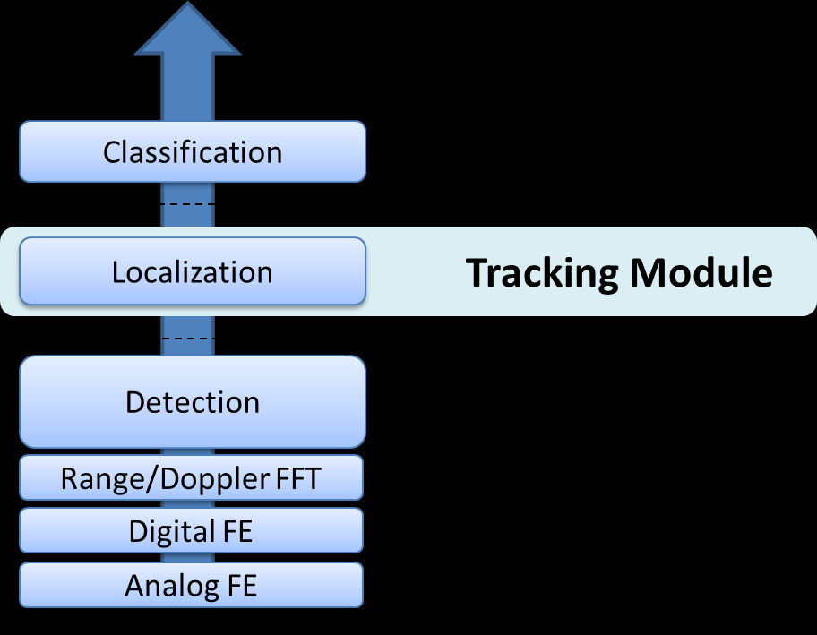

利用 high resolution Radar sensors高分辨率雷达，detection 层能够感应现实targets的多次反射，从而提供丰富的测量vectors 矢量集（在某些情况下，每帧数千个矢量），称为点云 Point Cloud。
每个测量向量代表一个reflection 反射点，具有Range范围，Azimuth方位角和Radial velocity径向速度。 每个测量向量是可靠性信息。

Tracking 层将输入point cloud 点云数据，执行 target localization目标定位，并将结果（目标列表 a Target List）报告给classification 层。 因此，tracker 跟踪器的输出是一组具有某些属性（如position, velocity, physical dimensions, point density, 位置，速度，物理尺寸，点密度和其他特征）的可跟踪对象，分类器可以使用这些属性来进行识别决策。

 

## 1.2. Radar Geometry

下图显示了，在时刻n时，的 single reflection 单个反射点。 现实生活中的雷达目标由多个反射点表示。 每个点都由 range, angle, and radial velocity (range rate) 范围，角度和径向速度（范围率）表示：

 Range r, 𝑅𝑚𝑖𝑛 < 𝑟 < 𝑅𝑚𝑎𝑥
 Azimuth angle $\varphi ,-\phi_{max} <\varphi <+\phi _{max}$
 Radial velocity 𝑟

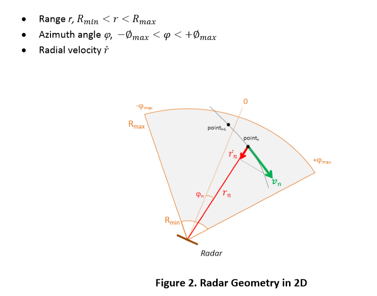

 

## 1.3. Choice of Tracking Coordinate System

为了方便目标运动推测target motion extrapolation，我们选择在 Cartesian coordinates笛卡尔系中进行跟踪。 这允许简单的 Newtonian linear prediction 牛顿模型。

我们选择将测量输入保持在 polar 极坐标中以避免误差耦合coupling。 我们将使用EKF来跟踪状态和测量向量之间的相关性。

Tracking 可以在2D或3D笛卡尔空间中进行。 对于每个空间，我们使用CV恒定速度模型或CA恒定加速度模型。（ constant  velocity model or constant acceleration model）

 

## 1.4 2D Space Geometry

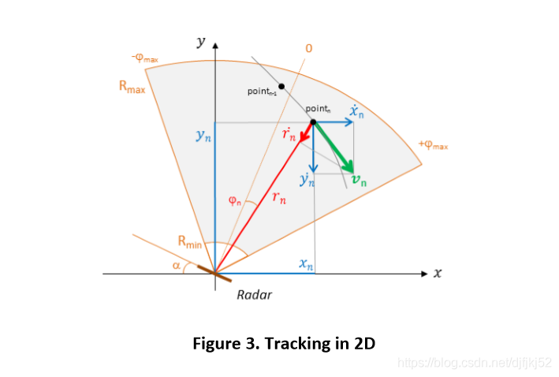

角位置坐标转换为笛卡尔坐标使用

𝑥 = 𝑟 cos (𝜋/2 − (𝛼 + 𝜑)) = 𝑟𝑠𝑖𝑛 (𝛼 + 𝜑) 

𝑦 = 𝑟 sin (𝜋/2 − (𝛼 + 𝜑)) = 𝑟𝑐𝑜𝑠(𝛼 + 𝜑)

目的是使用距离，角度和多普勒（径向速度） range, angle, and Doppler (radial velocity) 的测量(带有噪声)来跟踪对象的位置

## 1.5. 2D Space, Constant Velocity Model

### 我们使用卡尔曼滤波器来提取位置估计

卡尔曼滤波器在时刻n的状态定义为$$𝒔(𝑛) = 𝑭𝒔(𝑛 − 1) + 𝒘(𝑛)$$

> 其中，状态向量𝒔(𝑛）定义为笛卡尔坐标，匀速直线控制量为0无需控制矩阵
> 
> x(n)为点的横坐标
> 
> y(n)为点的纵坐标
> 
> $\dot{x}(n)$为点的横坐标速度分量
> 
> $\dot{y}(n)$为点的纵坐标速度分量
> 
> $\triangle t$为采样时间

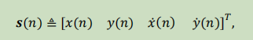

F预估转换矩阵为

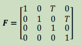

𝒘(𝑛）是具有协方差矩阵𝑸(𝑛）的大小为4×4 的过程噪声的向量

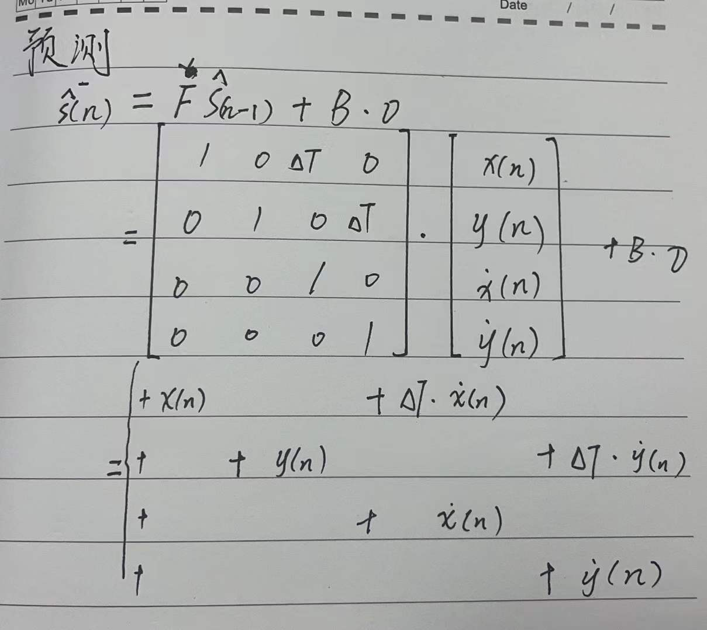

 

### 观测：

input 测量矢量𝒖(𝑛）包括范围、角度和径向速度

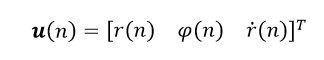

卡尔曼滤波器的状态与测量向量之间的关系表示为：$$𝒖(𝑛) = 𝑯(𝒔(𝑛)) + 𝒗(𝑛)$$

H预估转换矩阵为

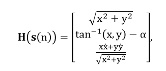

其中，函数$tan^{-1}(x,y)$被定义为

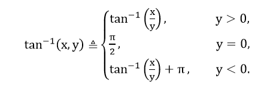

𝒗（𝑛）是具有协方差矩阵𝑹（𝑛）的大小为3×3测量噪声的向量，

 

### EKF

观测：（预估不用EKF）

在上述公式中，观测向量𝒖(𝑛）通过非线性关系与估计状态向量𝒔(𝑛）有非线性关系。因此，我们使用扩展卡尔曼滤波器(EKF)，它通过只保留𝑯的Taylor级数展开式中的第一项，简化了𝒖（𝑛）和𝒔（𝑛）之间的关系$$𝒖(𝑛) = 𝑯(𝒔_{𝑎𝑝𝑟}(𝑛)) + 𝑱_𝑯(𝒔_{𝑎𝑝𝑟}(𝑛))*[𝒔(𝑛) − 𝒔_{𝑎𝑝𝑟}(𝑛)] + 𝒗(𝑛)$$

$𝒔_{𝑎𝑝𝑟}(𝑛)$是先验估计(先验)基于n-1次测量的状态向量 

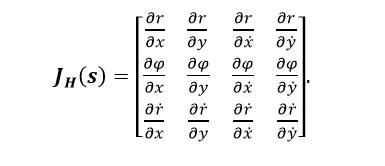

计算偏导数（见下文附录）

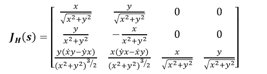

 

## 1.6. 2D Space, Constant Acceleration Model

卡尔曼滤波器在时刻n的状态定义为$$𝒔(𝑛) = 𝑭𝒔(𝑛 − 1) + 𝒘(𝑛)$$

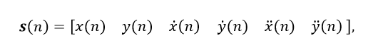

F预估转换矩阵为

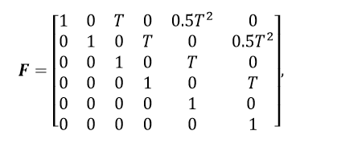

𝒘(𝑛）是具有协方差矩阵𝑸(𝑛）的大小为6×6 的过程噪声的向量

### 观测：

input 测量矢量𝒖(𝑛）包括范围、角度和径向速度

卡尔曼滤波器的状态与测量向量之间的关系表示为：$$𝒖(𝑛) = 𝑯(𝒔(𝑛)) + 𝒗(𝑛)$$

H为预估的极坐标转换矩阵为

**EKF**

观测：（TI本案例状态方程一般是线性的，不用展开，先转换成极坐标H）

在上述公式中，观测向量𝒖(𝑛）通过非线性关系与估计状态向量𝒔(𝑛）有非线性关系。因此，我们使用扩展卡尔曼滤波器(EKF)，它通过只保留𝑯的Taylor级数展开式中的第一项，简化了𝒖（𝑛）和𝒔（𝑛）之间的关系$$𝒖(𝑛) = 𝑯(𝒔_{𝑎𝑝𝑟}(𝑛)) + 𝑱_𝑯(𝒔_{𝑎𝑝𝑟}(𝑛))*[𝒔(𝑛) − 𝒔_{𝑎𝑝𝑟}(𝑛)] + 𝒗(𝑛)$$

$𝒔_{𝑎𝑝𝑟}(𝑛)$是先验估计(先验)基于n-1次测量的状态向量 

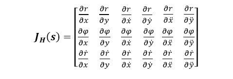

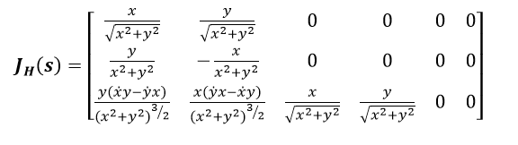

 

## 1.7. 3D Space, Geometry

> 传感器位于原点。
目标以速度向量移动。
测量矢量包括距离、方位角，俯仰角和径向速度

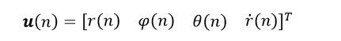

笛卡尔坐标中的状态向量将用于恒速模型，

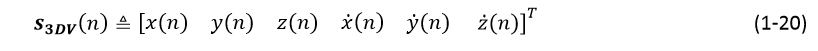

恒加速度模型，

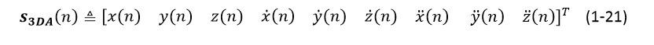

 

 

## 1.8. 3D Space, Constant Velocity Model (3DV) and Constant Acceleration (3DA) models

卡尔曼滤波器在时刻n的状态定义为$$𝒔(𝑛) = 𝑭𝒔(𝑛 − 1) + 𝒘(𝑛)$$

F预估转换矩阵为

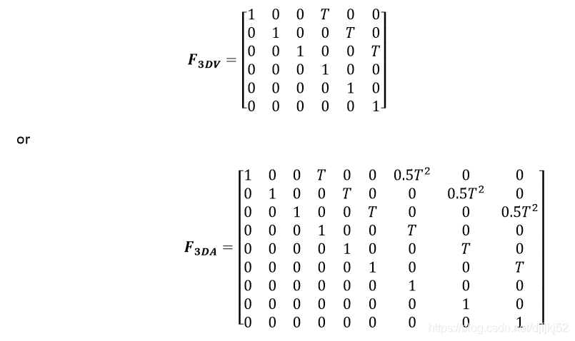

观测：

input 测量矢量𝒖(𝑛）包括范围、角度和径向速度

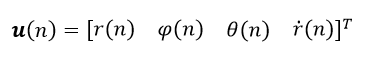

卡尔曼滤波器的状态与测量向量之间的关系表示为：

$$𝒖(𝑛) = 𝑯(𝒔(𝑛)) + 𝒗(𝑛)$$

H为预估的极坐标转换矩阵为

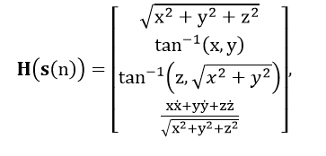

**EKF**

观测：（TI本案例状态方程一般是线性的，不用展开，先转换成极坐标H）

在上述公式中，观测向量𝒖(𝑛）通过非线性关系与估计状态向量𝒔(𝑛）有非线性关系。因此，我们使用扩展卡尔曼滤波器(EKF)，它通过只保留𝑯的Taylor级数展开式中的第一项，简化了𝒖（𝑛）和𝒔（𝑛）之间的关系$$𝒖(𝑛) = 𝑯(𝒔_{𝑎𝑝𝑟}(𝑛)) + 𝑱_𝑯(𝒔_{𝑎𝑝𝑟}(𝑛))*[𝒔(𝑛) − 𝒔_{𝑎𝑝𝑟}(𝑛)] + 𝒗(𝑛)$$

$𝒔_{𝑎𝑝𝑟}(𝑛)$是先验估计(先验)基于n-1次测量的状态向量 

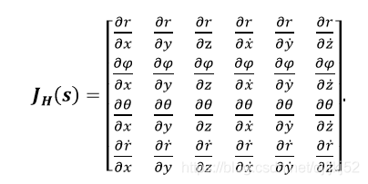

 

# 2.Kalman Filter Operations

### 2.1. Prediction Step

 

### 2.2. Update Step

 

## 2.3. Design of Process Noise Matrix

Q(n）的选择对于卡尔曼滤波器的行为很重要。 如果太小，则滤波器在其预测模型中会过分自信，并且会偏离实际解。 如果太大，则滤波器会受到测量噪声的太大影响，并且表现欠佳。

运动系统（可以使用牛顿运动方程式建模的系统）是连续的，即它们的输入和输出可以在任意时间点变化。 但是，此处使用的卡尔曼滤波器是离散的。 我们定期对系统进行采样。 因此，我们必须在上式中找到噪声项的离散表示。 这取决于我们对噪声行为做出的假设。 我们将考虑两种不同的噪声模型。

 

## 2.3.1. Continuous White Noise Model 连续白噪声模型

假设我们需要对position, velocity, and acceleration位置，速度和加速度进行建模。 然后我们可以假设每个离散时间步长的加速度都是恒定的(CA)。 当然，系统中存在过程噪声，因此加速度实际上不是恒定的。 跟踪的物体会由于外部未建模的力而随着时间改变加速度。 在本节中，我们将假设加速度以连续时间零均值白噪声变化(CV)。

由于噪声不断变化，我们将需要integrate 结合以获得针对所选discretization interval 离散化间隔的 discrete noise 离散噪声。 我们在这里不做证明，但是噪声离散化的方程是

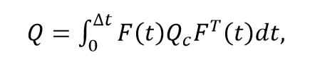

Q是连续噪声。

$F(t)Q_c F^T(t)$是在t时刻基于F的连续噪声的投影

我们想知道在离散间隔Δt中向系统添加了多少噪声，因此我们在间隔[0，Δt]上对该表达式进行积分。

对于二阶牛顿系统，基本矩阵是

我们现在将连续噪声定义为

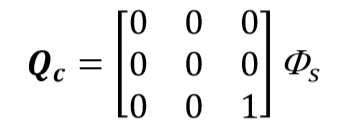

$Φ_s $是白噪声的频谱密度。

这可以导出，但超出了当前的任务范围。

在实践中，我们通常不知道噪声的频谱密度 spectral density of the noise，因此这变成了“工程”因素-我们通过实验调整这个数字，直到滤波器达到预期效果为止。

我们可以看到，将乘以的矩阵有效地将功率谱密度分配给了加速度项。

这很有道理； 我们假设系统具有恒定的加速度，但噪声引起的变化除外。 噪音会改变加速度。

计算积分，我们得到

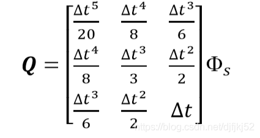

外推回到6个状态

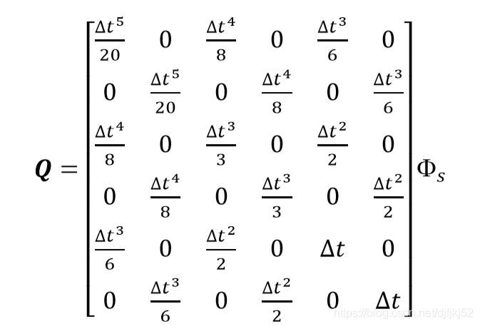

 

## 2.3.2. Piecewise White Noise Model 分段白噪声模型

噪声的另一种模型假设最高阶项（例如，加速度）在每个时间段的持续时间内是恒定的，但在每个时间段都不同，并且每个时间段之间都是不相关的。 换句话说，每个时间步长的加速度都有不连续的跳跃。 这与上面的模型有细微的差别，在上面的模型中，我们假定最后一项施加了一个连续变化的噪声信号。

我们将此建模为

其中$\Gamma$ 是系统的噪声增益gain of the system，而𝑤是恒定的分段加速度（或速度或加速度，等等）。

For the second order system 二阶系统

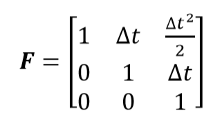

在一个时间段内，加速度的变化为𝑤（𝑡），速度的变化为𝑤（𝑡）∆𝑡，位置变化为w（𝑡）∆𝑡^2 / 2

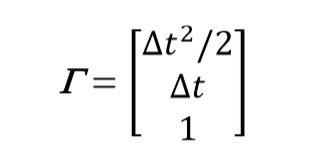

The covariance of the process noise is 过程噪声的协方差为

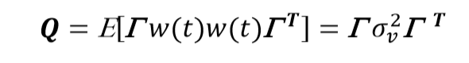

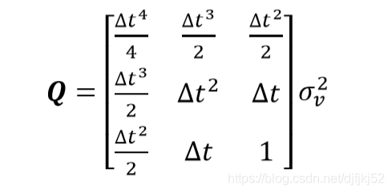

目前尚不清楚该模型是否比连续模型更正确-两者都近似于实际物体所发生的情况。 只有经验和实验才能指导适当的模型。 可以预期，任何一个模型都能提供合理的结果，但通常一个模型的性能会优于另一个模型。

第二个模型的优点是我们可以用$𝜎^2$建模噪声，可以用运动和期望的误差量来描述噪声。 第一个模型要求我们指定频谱密度，这不是很直观，但是由于噪声是在整个时间段内积分的，因此它更容易处理变化的时间样本。 但是，这些不是固定的规则-根据测试过滤器的性能和/或您对物理模型行为的了解，使用任何模型（或您自己设计的模型）。

一个好的经验法则是将 𝜎 设置为:0.5*∆𝑎至∆𝑎，

其中∆𝑎是加速度在采样周期之间变化的最大值。

实际上，我们选择一个数字，对数据进行模拟，然后选择一个合适的值。
