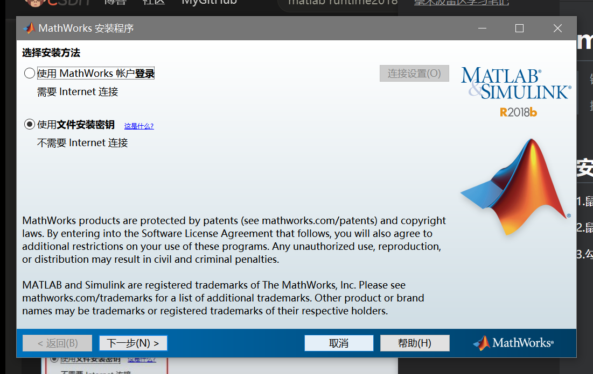
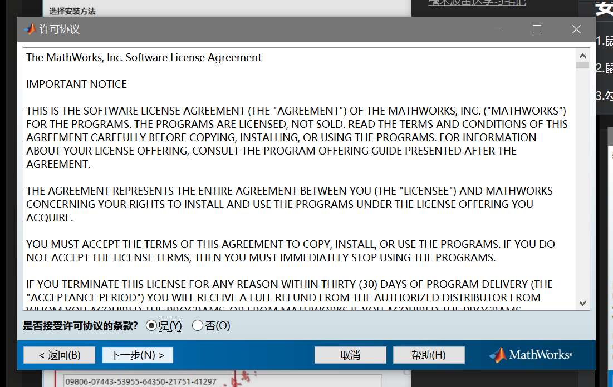
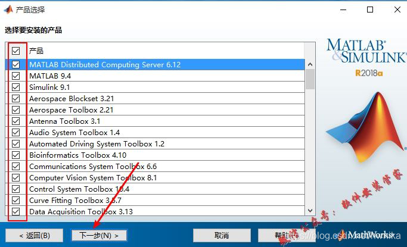
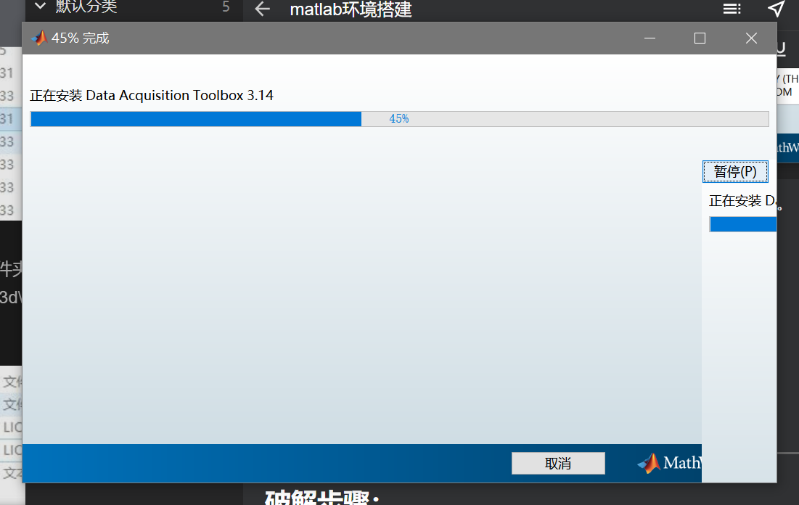
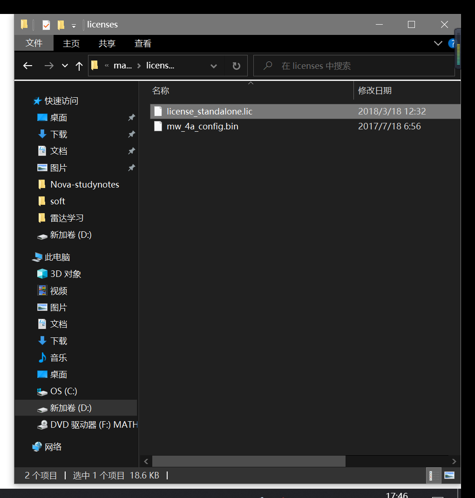
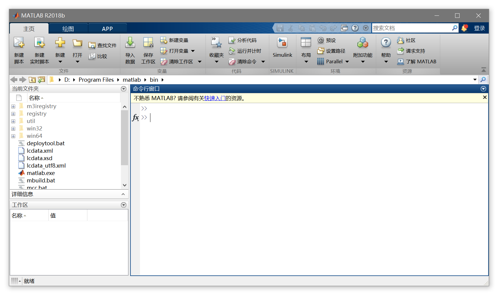

# matlab环境搭建

> 链接: https://pan.baidu.com/s/1J8qS7fNpa8vx-NBf0Sd-wQ?pwd=66tn 
> 
> 提取码: 66tn 

 

## 安装步骤：

1.鼠标右击“R2018b_win64_2”压缩包，装载。

2.鼠标右击“setup”，选择“以管理员的身份运行”。

3.勾选“使用文件安装密匙”，点击下一步。

4.勾选“是”，点击下一步。

5.输入安装密匙：09806-07443-53955-64350-21751-41297，点击下一步。

6.点击浏览，然后点击下一步。

7.用户可以选择需要安装的产品，我这里选择安装全部产品，点击下一步。

8.点击安装。

9.软件安装中，大约需要30分钟（电脑配置越好，所需安装时间越短）。

10.点击完成。

 

***

## 破解步骤：

> 链接: https://pan.baidu.com/s/1LdIk7VK_7mtSod4ICGmtQw?pwd=wy7t 
> 
> 提取码: wy7t 复制这段内容后打开百度网盘手机App，操作更方便哦

11.打开文件夹R2018a_Win64_Crack，复制“license_standalone.lic”文件到安装路径licenses文件夹里

12.复制Crack文件里R2018a文件夹下的“bin”文件到安装目录下，并选择“替换目标中的文件”。

14.桌面没有MATLAB的启动快捷方式，在安装路径\bin下，鼠标右击“matlab”选择发送到桌面快捷方式。

