sdk环境搭建

参考如下:

> 视频参考：
> 
> 文档参考 : 
> 
>  

## 学习进度

- [ ] S32DS下载并安装
- [ ] FFT的具体过程

 

### S32DS下载并安装

***

1.进入[nxp官网](https://www.nxp.com.cn/design/software/development-software/s32-design-studio-ide/s32-design-studio-for-power-architecture:S32DS-PA)，找到目标版本（WIN下载S32DS_Power_Win32_v2.1.exe）

[个人链接](https://nxp.flexnetoperations.com/control/frse/download?agree=Accept&element=10944607)

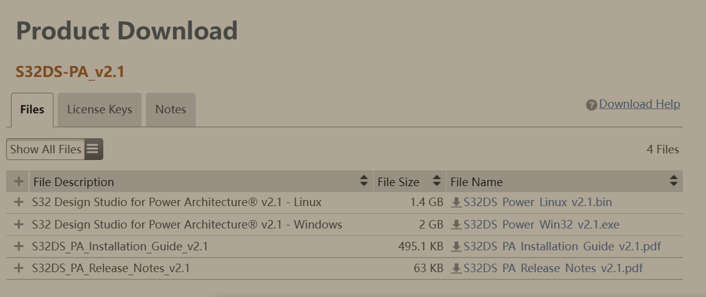

2. 邮箱登陆的话会给邮箱发送licence
   
   **744C-97DA-4A41-8162**

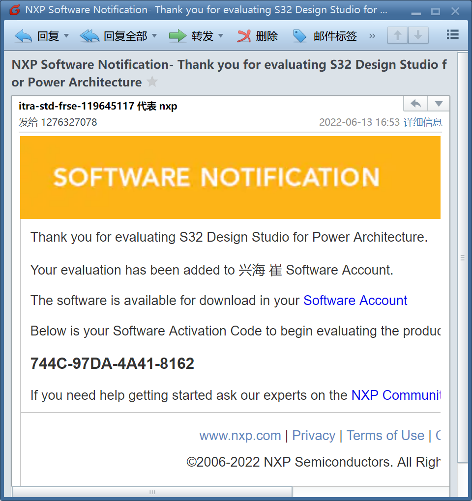

3、 点击下载好的IDE包，开始安装

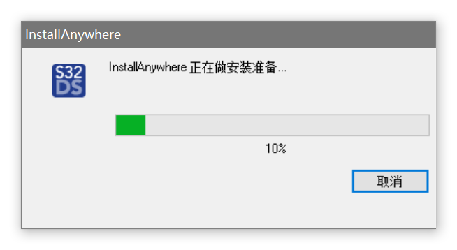

4、选择第二个additionally install

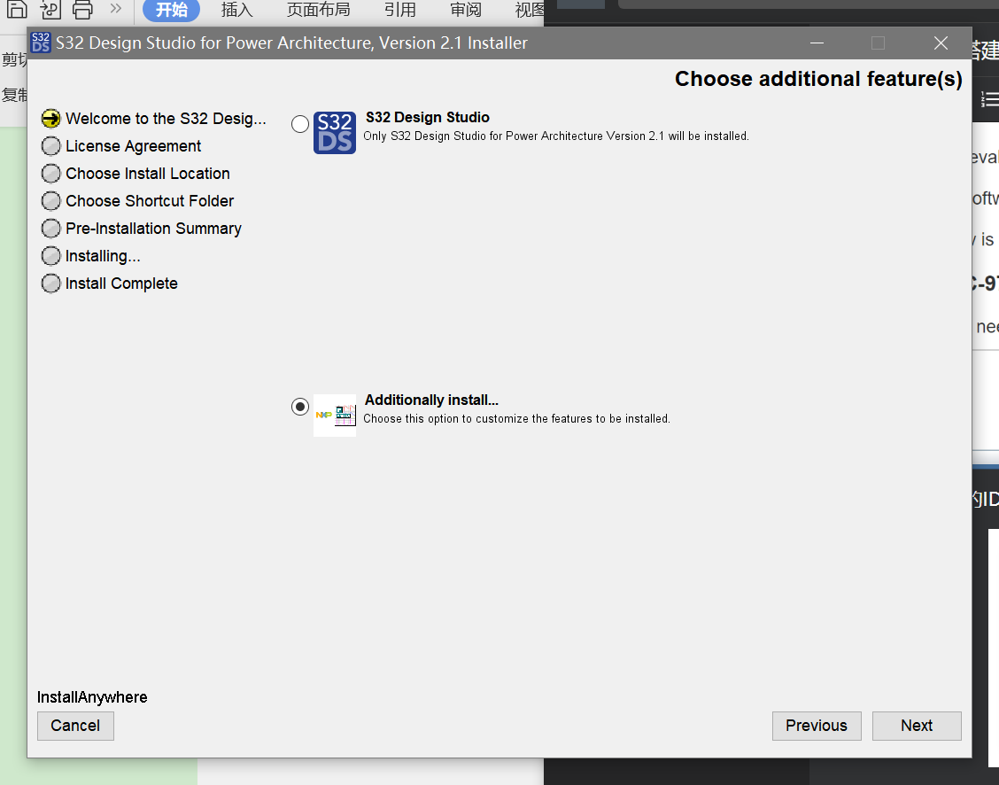

 

5、选项（支持freemaster在线调试）

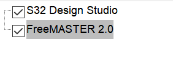

6、开始安装会弹出要求输入激活码，输入第三步记录下来的激活码后，选择激活类型，选择online

7.一直下一步，安装完成

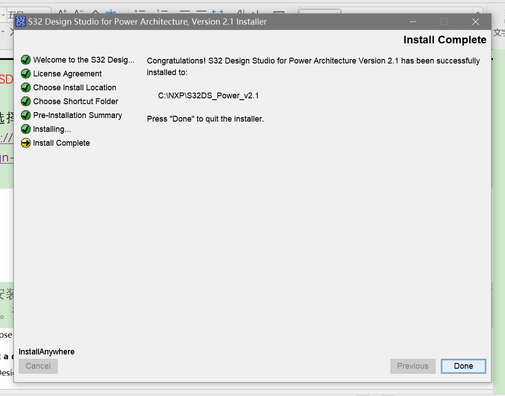

 

 

### 二．SDK更新并安装

1、选择以下版本下载（[v2.1 update 14](https://www.nxp.com/design/software/development-software/s32-design-studio-ide/s32-design-studio-for-power-architecture:S32DS-PA)）
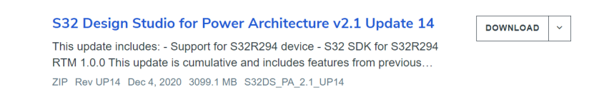

2、安装完成。打开软件（S32 Design Studio for Power Architecture Version 2.1），出现如下界面。预先自定义文件的存放路径，选择该路径，点击OK

3.选择第一个

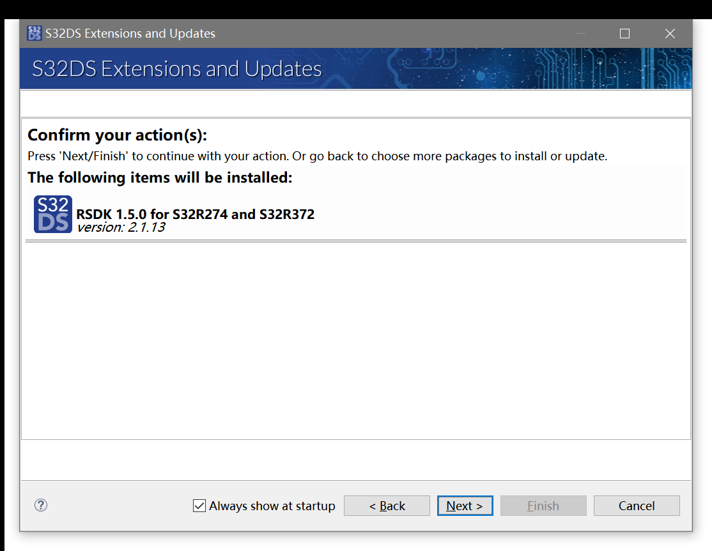

4、离线安装SDK。点击help-> Install New Software

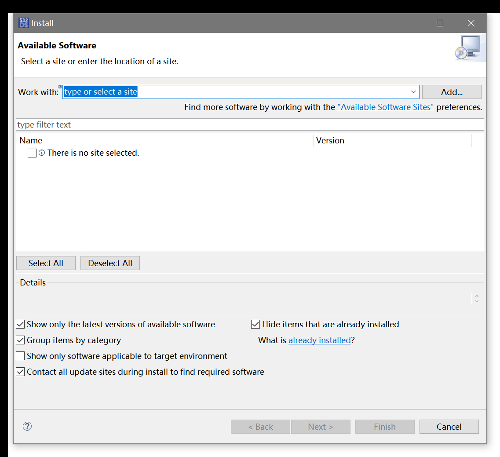

6、点击add->Archive选择之前下载的SDK包。

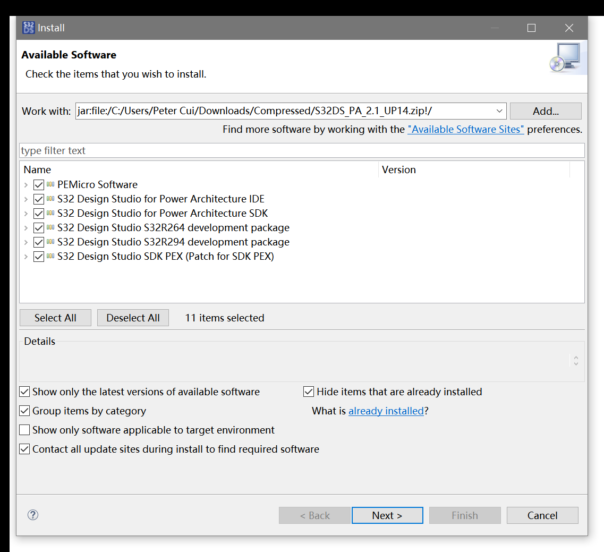

7、一直下一步，等待安装完成即可。

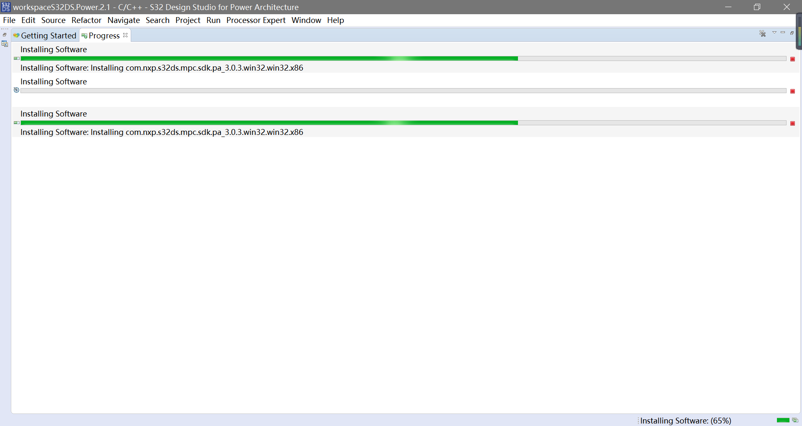
