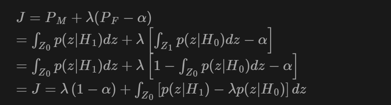

# 恒虚警检测器CFAR学习笔记

参考如下:

> 视频参考：
> 
> 文档参考 :[雷达系统必备知识——恒虚警检测器CFAR](https://zhuanlan.zhihu.com/p/269840008)
> 
> 				[恒虚警检测（Constant False Alarm Rate, CFAR）](https://blog.csdn.net/weixin_42647783/article/details/89449048)
> 
> 				[恒虚警率](https://baike.baidu.com/item/%E6%81%92%E8%99%9A%E8%AD%A6%E7%8E%87/21125186)
> 
>  

## 学习进度

- [ ] CFAR简介
- [ ] CFAR原理

 

一、CFAR简介

***

- CFAR：全称是Constant False Alarm Rate Detector，恒定虚警概率下的检测器，是雷达目标检测的一种常见的手段。

- 恒虚警率特性：在雷达信号检测中，当外界干扰强度变化时，雷达能自动调整其灵敏度，使雷达的虚警概率保持不变

- 获得方法：参量法和非参量法。

- 虚警率：是指侦察设备在单位时间内将噪声或其他干扰信号误判为威胁辐射源信号的概率。

- 对于雷达或声呐检测来说，可以选用两个假设，即目标存在或不存在。

	由于噪声的存在及观察样本数或样本长度的限制，在检测过程中，不可避免地会产生判决错误。问题是怎样尽可能地减少这些错误，这就是检测系统的最佳化问题。错误一般分为两种，一种是漏报，一种是虚警，在不同的工作情况下，这两种错误所造成的后果并不一样，因此可能对不同的错误有不同的重视程度，这就引入了最佳准则问题。不同的准则下有不同的判决规则（如选取的判决门限不同），使得检测系统有不一样的虚警错误和漏报错误分配。 这样的准则有最小平均风险准则（又称Bayes准则）、极大极小准则（又称安全平均风险准则）和Neyman-Pearson准则（又称检测概率最大准则）等。

> Bayes 准则需知道先验概率和代价函数，极大极小准则需知道代价函数。
> 
> Neyman-Pearson 准则则是解决二者均不知的判决问题，该方法是确定虚警概率或漏报概率中的一种，再去求使另一种达到极小的判决，也就是假定有一类错误最重要，因而作出严格的限制，再去确定使其它类错误最小的判决界。一般对虚警要求较高，所以，==先限定虚警，再去求最小漏报或最大检测==，所以 N-P 准则有时也叫恒虚警检测。 恒虚警检测技术（CFAR，Constant False-Alarm Rate）是雷达系统在保持虚警概率恒定条件下对接收机输出的信号与噪声作判别以确定目标信号是否存在的技术。

二、CFAR原理

***

> 恒虚警检测器首先对输入的噪声进行处理后确定一个门限，将此门限与输入端信号相比，如输入端信号超过了此门限，则判为有目标，否则，判为无目标。一般信号由信号源发出，在传播的过程中受到各种干扰，到达接收机后经过处理，输出到检测器，然后检测器根据适当的准则对输入的信号做出判决。
> 
>  

**2.1 定义**

***

信号接收机输出端的信号用x(t)表示，这里存在两种情况：

> 噪声和信号同时存在：x(t)=s(t)+n(t)
只有噪声存在,无信号:  x(t)=n(t)

设噪声概率密度函数为$p(x|{{H}_{0}})$

用$H_{0}$ 和$ H_{1}$ 分别表示接收机的无信号输入和有信号输入的假设；
用$ D_{0}$和$ D_{1}$ 分别表示检测器作出无信号和有信号的判决结果。

于是接收机的输入与检测器的判决将有四种情况：

> $ H_{0}$为真，判为$ D_{0}$ ，即接收机无信号输入，检测器判为无信号，称为正确不发现；
$ H_{0}$为真，判为$ D_{1}$ ，即接收机无信号输入，检测器判为有信号，称为虚警；
$ H_{1}$为真，判为$ D_{0}$，即接收机有信号输入，检测器判为无信号，称为漏警；
$ H_{1}$为真，判为$ D_{0}$，即接收机有信号输入，检测器判为有信号，称为正确检测；

其中第一种情况和第四种情况属于正确判决，其余两种属于错误判决。

用$p(z|{{H}_{0}})$和$p(z|{{H}_{1}})$分别表示无信号输入和有信号输入接收机时，接收机输出端的信号电平的概率密度函数；
用$Z_{0}$和$Z_{1}$ 分别表示检测器作出无信号和有信号判决的判决区域，当输入的电平在$ Z_{0}$ 区域判为无信号，在$ Z_{1}$区域判为有信号。

2.2 推导

***

设虚警概率为${P}_{F}$ ，漏报概率为${P}_{M}$ ，检测概率为${P}_{D}$，则N-P准则为

$$P_{F}=\alpha（一般在0.1-0.05） 
 $$

$$P_{M}=min\bigstar或 1-P_{M}=max$$

利用拉格朗日乘子λ构造目标函数

显然$ P_{F}=\alpha$时，使J达到最小就等价于使$ P_{M}$达到最小。于是令J 对${Z}_{0}$
 的导数为0，也就是积分号内值为0 ，则有$$\lambda (z_{0})=\frac{p(z_{0}|H_{1})}{p(z_{0}|H_{0})}=\lambda $$

而似然比为$$\lambda (z)=\frac{p(z|H_{1})}{p(z|H_{0})}$$

这里$ {z}_{0}$就是电平比较门限，若输入电平$ {z}$大于$ {z}_{0}$ ，也就是λ(z)大于λ，判决有信号输入；若输入电平z小于$ {z}_{0}$ ，也就是λ(z)小于λ时，判决无信号输入。

其中λ的取值由$P_{F}=\alpha$确定。在输入信号是一维的情况下，可由下式求得λ。$$\int_{\lambda }^{\infty }P[\lambda (z)|H_{0}]d\lambda (z)=\alpha $$

或者由下式求得$z_{0}$
 $$P_{F}=\int_{z_{0}}^{\infty }p[z|H_{0}]dz$$

再由下式求得λ。

$$\frac{p(z_{0}|H_{1})}{p(z_{0}|H_{0})}=\lambda $$

2.3 总结

***

	雷达信号的检测总是在干扰背景下进行的，这些干扰包括接收机内部的热噪声，以及地物、雨雪、海浪等杂波干扰，有时还有敌人施放的有源和无源干扰。杂波和敌人施放干扰的强度常比接收机内部噪声电平高得多。因此，在强干扰中提取信号，不仅要求有一定的信噪比，而且必须对信号作恒虚警处理。
