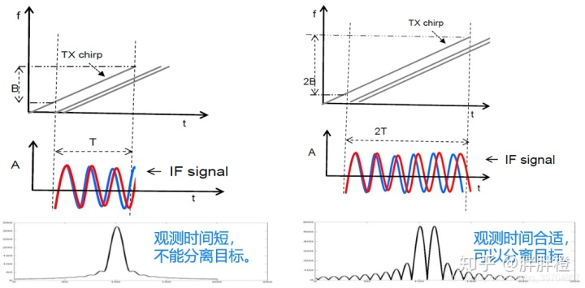

# 毫米波雷达学习笔记

<br/>

***参考如下:***

视频参考：

文档参考 : 

```
            毫米波传感器基础知识.pdf

            [毫米波雷达基础知识（一）](https://baijiahao.baidu.com/s?id=1712657247238932089)

            [TortoiseSVN的安装与使用](https://blog.csdn.net/qq_28566071/article/details/80857928)

            [ADAS系统科普——毫米波雷达基本原理](https://zhuanlan.zhihu.com/p/300005345)
```

<br/>

## 学习进度

- [ ] 毫米波传感器基础知识
  
  
- [ ] 

<br/>

### 

### 毫米波传感器基础知识

***

- **概念：**毫米波（mmWave）是一类使用短波长电磁波的特殊雷达技术。雷达系统发射的电磁波信号被其发射路径上的物体阻挡继而会发生反射。通过捕捉反射的信号，雷达系统可以确定物体的距离、速度和角度。
- **分类：**
  
  根据辐射电磁波方式不同，毫米波雷达主要分为脉冲体制以及连续波体制两种工作体制，而FMCW调频连续波是最常用的车载毫米波雷达。
  
  
- **FMCW毫米波雷达：**发射信号波长为毫米级别的，使用FMCW（调频连续波）工作原理的雷达。连续发射线性调频信号，以测量距离以及角度和速度。这与周期性发射短脉冲的传统脉冲雷达系统不同。例如77Ghz的雷达，波长只有4mm左右。


- **优势：**处理毫米波信号所需的系统组件（如天线）的尺寸很小，可将用于发送（TX）和接收（RX）的射频（RF）组件，时钟模拟组件，还有模数转换器（ADC）、微控制器（MCU）和数字信号处理器（DSP）等数字器件集成分布，降低功耗和系统总成本。
- **FMCW与CW的区别：**线性调频连续波（FMCW）雷达是连续波雷达的一种特殊类型，相对于简单连续波（CW）雷达，通过对发射信号的频率调制（或相位调制）来改变其工作频率。通过对工作频率（或相位）的测量来实现对目标信息的探测。
  
  <br/>
  
  ## 1.测距离
  
  信号的频率随时间变化呈线性升高。下图以幅度（振幅）相对时间的形式，展示线性调频连续波信号。
  > chirp信号：在FMCW雷达中使用的信号中，频率随时间线性增加。
  
  

<br/>

下图为同一个线性调频连续波信号（以频率相对于时间的形式）。


起始频率$f_{c}$、带宽B和持续时间（观测时间长度）$T_{c}$

该线性调频信号的斜率S表示频率的变化率。

图中$f_{c}$=77GHz，B=4GHz，$T_{c}$=44us，S=100。

<br/>

下图为FMCW雷达主射频组件的简化框图。


该雷达的工作原理如下：
1、合成器生成一个线性调频信号；
2、该线性调频信号由发射天线（TX 天线）发射；
3、该线性调频脉冲经物体反射生成一个由接收天线（RX 天线）接收的反射线性调频信号；
4、“混频器”将RX信号和TX信号合并到一起，生成一个中频 (IF) 信号。

> 混频器原理：混频器是一个电子器件，将两个信号合并到一起生成一个具有新频率的信号。
> 
> 
> 
> 

# 单个静态物体测距离

下图中的图(a)为针对单个静态物体的TX和RX线性调频脉冲的时间-频率波形图。该RX的线性调频信号是TX线性调频信号的延时版本。


> $S_{\tau}$ :雷达发射天线发射Chrip信号，经过时间  $\tau $后，接收天线收到目标反射回来的信号， 其频率差
> 
> $f_{0}$ : 中频信号的频率 为$f_{0}= S\tau $
> 
> f：频率
> 
> t:  时间
> 
> $\tau $：从发射信号起到接收到回波的时间，也称为时滞。
> 
> d:  雷达天线与被检测目标的距离
> 
> c：光速
> 
> <br/>

根据图a有公式一，延时$\tau $与目标距离 d 有如下关系：$$d=\frac{c\ast \tau }{2}$$

公式二，$$\frac{S_{\tau }}{\tau }=\frac{B}{T_{c}}$$ 

<br/>

联立得测距离：$$d=\frac{c\ast \tau \ast T_{c}}{2B}$$

# 多个静态物体测距离

通过傅里叶变换，将时域信号转为频域信号，时域中的正弦波在频域中产生一个峰值，对应于正弦波信号的频率。


雷达通过接收不同物体的发射信号，并转为IF信号，利用傅里叶变换将产生一个具有不同的分离峰值的频谱，每个峰值表示在特定距离处存在物体。

> 两个目标距离多近时，可以进行有效进行区分？
> 
> 距离分辨率！

<br/>

## 2.测距离分辨率

- **概念：**距离分辨率是雷达在距离维度上辨别两个或更多物体的能力。当两个物体相对于雷达的距离近到某个特定值时，雷达便不能再将二者区分开，将两个物体分辨为同一个物体。
- 下图显示了接收自不同物体的三个不同的RX线性调频脉冲。


线性调频毫米波雷达是通过对 IF 信号频率的测量来确定目标的位置等信息。将物体区分开即为将谱峰区分开。也就是说距离分辨率转换为频率分辨率。



有    


式中，$B=S\ast T_{c}$。

<br/>

所以，距离分辨率 为$$d_{Res}=\frac{c}{2B}$$

> eg:  当带宽为4GHz 时，$d_{Res}=\frac{c}{2B}$=3.75cm .
> 
> （距离分辨率仅取决于chirp扫过的带宽，带宽越大，距离分辨率越好）

## 3.最远探测距离

<br/>

IF信号通常经过数字化处理（LPF + ADC），才在DSP上进行进一步处理，因此，中频信号的大小取决于ADC采样频率（$f_{s}$）。


即，$$F_{s}>f_{IFmax}=S2d_{max}/c$$

ADC的采样率$f_{s}$限制了雷达的最大不模糊距离：

$$d_{max}=\frac{f_{s}c}{2\mu }$$

<br/>

<br/>

  ## 4.测中频信号

- ```
  回波信号为发射信号的延时副本，对于同一回波，其频率差是一定的。故发射信号与回波信号的相位差的即为初始相位差，
  ```
  
  相位=2$\pi $*周期数，

即    $$\phi_{0} =2*\pi \ast f_{c}*\tau $$

与$d=\frac{c\ast \tau }{2}$联立得，$$\phi _{0}=4*\pi \ast f_{c}*d/c$$

又频率=波速/波长，$$f=c/\lambda $$

进一步推导得，联立得初始相位，$$\phi _{0}=4*\pi *d/\lambda $$

因此，对于与雷达位置为d的物体，IF信号将是一个正弦波，$$Asin\left ( 2\pi f_{0}t+\phi _{0} \right )$$

> eg : 则对于一个线性调频毫米波雷达，如果雷达前方的物体改变其位置 1mm（对于 77GHz 雷达 1mm= λ/4）
> 
> IF 信号的相位变化为$\phi =4*\pi *d/\lambda = \pi$
> 
> 中频信号的频率变化为 $f=2dS/c$

<br/>

<br/>

 ## 5.测速度

  测速的基本原理，是依据多普勒效应：

> 当移动台以恒定的速率沿某一方向移动时，由于传播路程差的原因，会造成相位和频率的变化，通常将这种变化称为多普勒频移。它揭示了波的属性在运动中发生变化的规律。+0
> 
> 由于物体距离的变化 $\Delta R $ 会引起接收信号相位的变化，因此通过观测一段时间内的接收信号的相位变化，即可通过 [公式] $\Delta R/t  $估算出此时目标的速度。
> 
> 

- 傅里叶变换 FFT


> FFT变换将时域信号转换为频域；
时域中的正弦波在频域中产生一个峰值。 通常，频域中的信号为复数（即每个值都是具有振幅和相位的相量）。

<br/>

- 为了测量单个移动目标速度，FMCW雷达会发射两个间隔为$T_{c}$的线性调频Chirp信号。则与雷达相距的同一目标产生的两个 IF 信号经过距离 FFT 处理后将在同一位置出现不同相位的峰值。该相位差与物体移动的位移有关。
  ```
  又由傅里叶变换的性质可得，两个位于同一位置的 IF 信号谱峰具有不同相位的峰值。峰值的相位等于正弦波的初始相位。
  
  下图所示。
  ```


> $ T_{c}$为俩个发射脉冲间隔时间长短。

<br/>

```
有 $d=vT_{c}$  ,   与$\phi _{0}=4*\pi *d/\lambda$联立，得
```


<br/>

> 注意：只有当$\left| \Delta \phi \right|< \pi $时，公式才有意义。

<br/>

所以，最大测速为$$v_{max}=\frac{\lambda }{4T_{c}}$$

- **同一距离上多目标速度测量**
  
  如果速度不同的多个移动目标在测量时与雷达的距离相同，则双线性调频信号速度测量将方法不起作用。这些物体由于与雷达的距离相同，因而会生成IF频率完全相同的反射线性调频信号。因此，距离 FFT 会产生单个峰值，该峰值是所有这些距离相同的目标信号合并而来的。简单的相位比较技术将不起作用。
  
  在这种情况下，为了测量速度，雷达系统必须发射两个以上的线性调频脉冲。它发射一组 N 个等间隔线性调频脉冲。这组线性调频脉冲称为帧。下图显示了一个线性调频信号帧随时间变化的频率。


距离 FFT 处理反射回来的一帧线性调频信号，从而产生一组N个位置完全相同的峰值，但每个峰值都有一个不同的相位，包含来自这两个物体的相位成分（来自各个物体的单独相位成分由下图中的红色和蓝色相量表示）。


对与距离 FFT 峰值相对应的相量序列进行 FFT 来解析这两个对象。这称为多普勒-FFT，多普勒 FFT在 N 个相量上执行，以分辨两个物体，多普勒 FFT 结果如下图所示。

<br/>

$\phi_{1}$和$\phi_{2}$对应于各个物体连续线性调频信号之间的相位差，则目标速度为分别

$$v_{1}=\frac{\lambda \phi _{1}}{4\pi T_{c}}$$

$$v_{2}=\frac{\lambda \phi _{2}}{4\pi T_{c}}$$

***

- 求速度分辨率
  
  速度分辨率取决于帧的时间.    
  
  由DFT可知，当  时，速度可以分辨。
  
  由于$\Delta w$也是由以下方程式$$\Delta \phi =\frac{4\pi vT_{c}}{\lambda }$$

定义的，因而 当帧周期$\left (  V_{res}\right )T_{f}=NT_{c}$，

  可通过数学方法推导出速度分辨率∶

  雷达的速度分辨率与帧时间（T）成反比。

<br/>

其中 $T_{f}=NT_{c}$   表示一帧的时间，如图

这说明波长越短，一帧的时间越长雷达的速度分辨率越高。

<br/>

 ## 5.测角度

- FMCW雷达系统使用水平面估算反射信号的角度，该角度称为到达角（AoA）（Angle of Arrival ）。
- 当目标距离发生很小的变化时，会导致Range-FFT峰值处相位发生较大的变化，因此可利用物体与两个天线的距离差 $\Delta d$引起的相位变化估算到达角。

> 主要解决以下问题：
> 
> 角度估算的原理；
同距、同速的两个物体角度如何区分；
两个物体的角度差别为多大时，可以有效区分；
最大的视场角
> 
> <br/>

<br/>

### 角度测量原理

目标距离的微小变化会导致range-FFT峰值的相位变化。角度估计至少需要2个RX天线，从目标到每个天线的差分距离 [公式] 导致FFT峰值发生相位变化，该相位变化用于估计到达角。


由于相位变化与距离间的关系为：$\Delta\phi =\frac{2\pi \Delta d}{\lambda } $

假设天线间距离为 l,则$\Delta d=lsin\left ( \theta  \right ) $ ,因此可估算出到达角为：

$\theta=sin^{-1} \left ( \frac{\lambda \Delta \phi }{2\pi d} \right )$

<br/>

***

**估算的准确度**

由于$\Delta\phi  $ 取决于$sin\theta$ ，是一种非线性的依赖关系，因此当  $θ$接近 0时，角度的估算精度较高，$θ$ 接近 90 时，估算精度降低。

**最大角视场**:

雷达的最大角视场由雷达可以估算的最大 AoA 来界定。

当  \Delta\phi >  \pi  时，就会产生角度模糊，如下图所示：


因此要求：

$$ \Delta\phi=\frac{2\pi dsin\left ( \theta  \right )}{\lambda }< \pi \triangleright \triangleright \theta _{max}=sin^{-1}\left ( \frac{\lambda }{2d} \right )$$

**角度分辨率:**

随着到达角（AoA）的增加，角度分辨率逐渐降低。


因此，角度分辨率为：$\theta _{res}=\frac{\lambda }{Ndcos\left ( \theta  \right )}$

通常假设$d=\lambda /2$ , $\theta=0$ ,得： $\theta=\frac{2}{N} $

***

**总结**


<br/>

## 6.德州仪器毫米波传感器解决方案：

正如你所看到的，FMCW传感器能够通过射频、模拟和数字电子元件的组合来确定附近物体的范围、速度和角度。
图14是不同组件的框图
TI通过将DSP、MCU和TXRF、RXRF、模拟和数字组件集成到RFCMOS单片机中，为FMCW传感领域带来了创新


TI的RFCMOS毫米波传感器通过实现毫米波射频前端和MCU/HWA/DSP处理后端的灵活性和可编程性，将自己与传统的硅锗解决方案区分开来。硅锗溶液只能储存有限数量的chirps，并需要在实际帧中实时更新chirp和chirp剖面，TI的毫米波传感器解决方案能够在chirp帧前存储512个chirp与四个剖面。这种能力允许TI的毫米波传感器易于配置多种配置，以最大化从场景中提取的有用数据的数量。单个chirp和处理后端可以为实时应用需求量身定做，如更高的范围、更高的速度、更高的分辨率或特定的处理算法。用于“汽车”的TI毫米波传感器组合规模从高性能雷达前端到高集成单芯片边缘传感器。设计师可以解决先进的驾驶员辅助系统(ADAS)和自主驾驶安全法规-包括ISO26262。

<br/>

***
